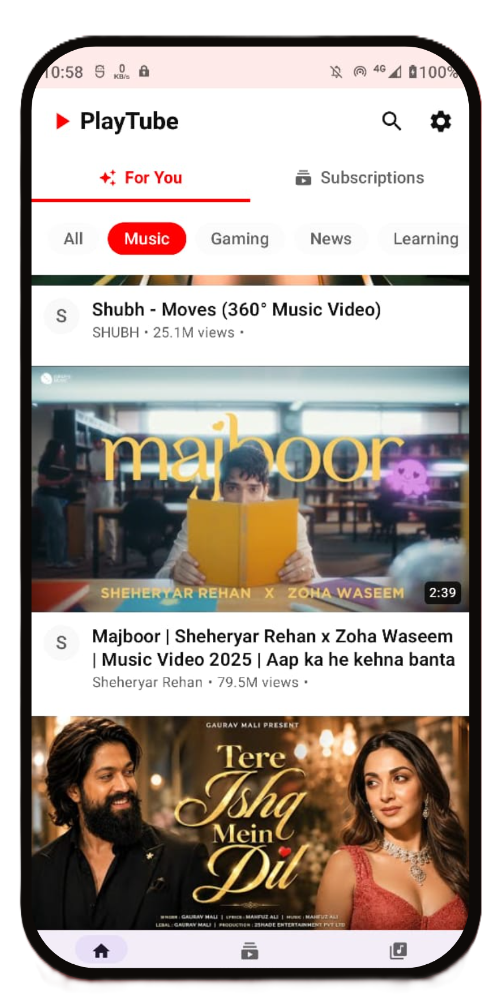
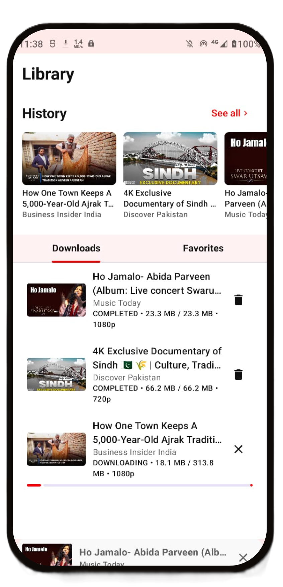
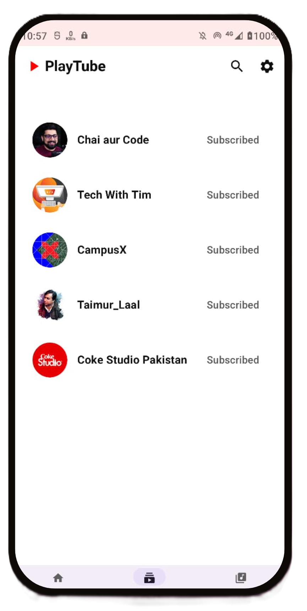
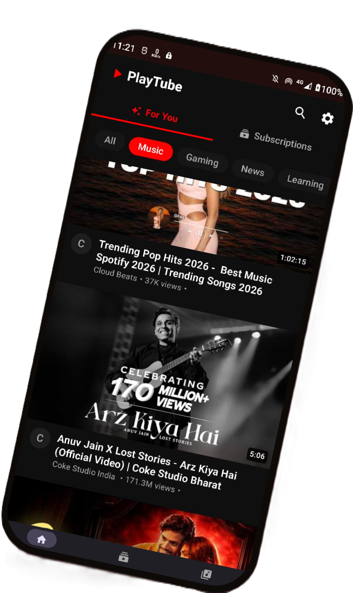

<table align="center">
  <tr>
    <td>
      
    </td>
    <td>
      <h1 style="margin: 0;">PlayTube</h1>
    </td>
  </tr>
</table>

  Fast, private, and feature-rich YouTube client for Android.

## Download

  

  

## Key Features
- Background Play
- Picture-in-Picture Support
- Highest available video quality downloads
- Built-in video volume/brightness and Seek forward/backward gestures
- Push up & down landscape/portrait modes
- Subscription Management
- Search History & Privacy
- Dynamic UI, Smooth, full-screen browsing experience.

## Subscriptions
- Subscriptions section in home screen shows videos only when you subscribe to a channel.
- Videos in subscriptions section appear only from subscribed channels.

## Screenshots

Enjoy a premium experience with no ads, tracking or whatsoever. Expect some bugs.

There is also support for downloading whole playlists, but for that your network connection has to be stable for smooth downloading.

The home page suggests videos based on your search history. If search history is paused, the app will not suggest videos in the home screen video list.
