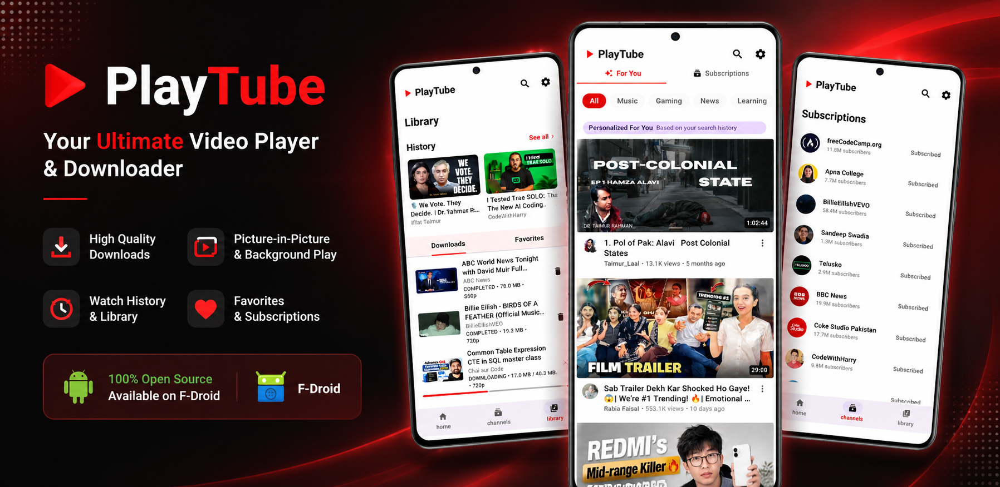
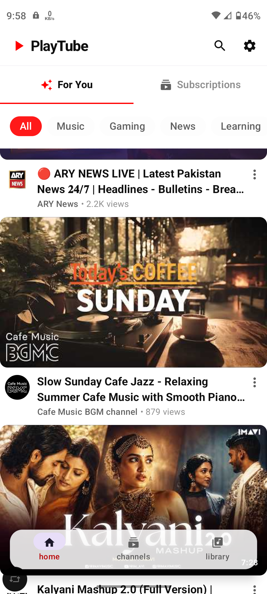
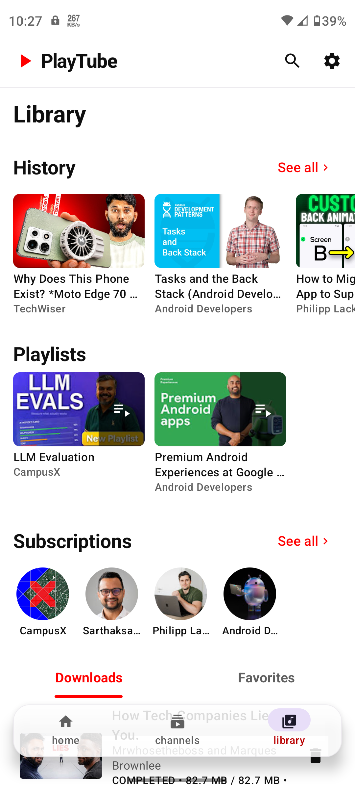
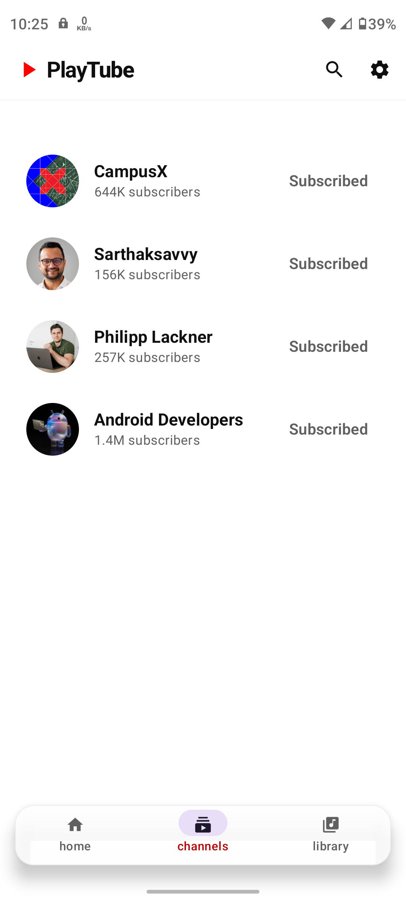
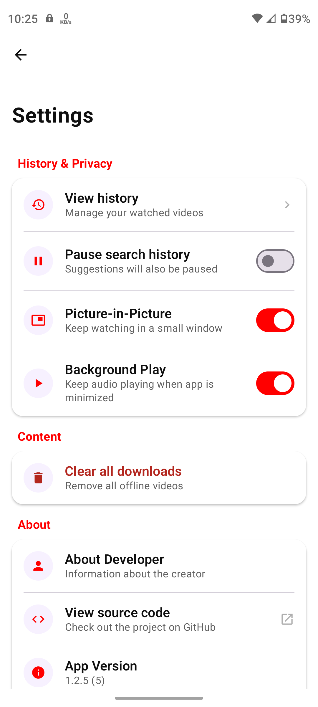
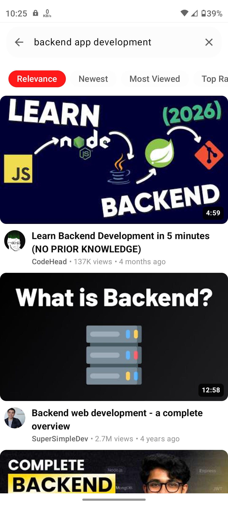

# PlayTube

  <b>Fast, private, and feature-rich YouTube client for Android. No Ads, tracking or data collection</b>

 

---

## ✨ Key Features
* Fluid Glass UI
* Background Play Support
* Picture-in-Picture Support
* Subtitles Support
* High quality video downloads up to 4K
* Built-in video volume/brightness and Seek forward/backward gestures
* Push up & down landscape/portrait modes
* Subscription Management (No Gmail Required)
* Search History & Privacy
* Dynamic UI, Smooth, full-screen browsing experience.

---

## 🛠️ Technology Stack

| Category | Technology | Description |
| :--- | :--- | :--- |
| **App Architecture** | **MVVM** | (Model-View-ViewModel) |
| | **Clean Architecture** | (Domain, Data & UI Layers) |
| | **Repository Pattern** | Centralized data access from local and remote sources |
| **Kotlin & Reactive**| **Kotlin Coroutines** | Handles asynchronous tasks and background operations |
| | **StateFlow** | Reactive UI state management |
| **UI Framework** | **Jetpack Compose** | 100% declarative UI toolkit |
| | **Material Design 3** | Modern Android UI components and dynamic theming |
| | **Compose Animations**| Smooth UI animations and transitions |
| **Data Storage** | **Room Database** | Stores user Metadata |
| | **Jetpack DataStore** | Stores user preferences such as PiP and History settings |
| **Media & Networking**| **AndroidX Media3** | (ExoPlayer) video, audio playback |
| | **Coil 3** | Fast image loading with caching |
| | **NewPipeExtractor** | Extracts YouTube streams and metadata |
| | **OkHttp** | HTTP networking client |
| **Background & DI** | **Hilt (Dagger)** | Dependency Injection |
| | **WorkManager** | Reliable background downloads |
| **Build & Tooling** | **KSP** | Kotlin Symbol Processing annotation processing for Room & Hilt |
| | **Version Catalogs** | Centralized dependency version management |

---

## 📱 Screenshots

  
  
  
  
  

 

  <h2 style="color: #d73a49;">🛑 WARNING 🛑</h2>
  

    Publishing this app on the Google Play Store violates their Terms of Service.
  

 

---

## Support PlayTube

If you enjoy using **PlayTube** and would like to support its continued development, consider becoming a patron.

Your support helps fixing bugs and long-term maintenance.

---

## 📌 Important Notes

* **Subscriptions:** Subscriptions tab in home screen shows videos only when you subscribe to a channel. Videos in subscriptions tab appear only from subscribed channels.
* **Recommendations:** The home page suggests videos based on your search history. If search history is paused, the app will not suggest search related videos in home screen.

