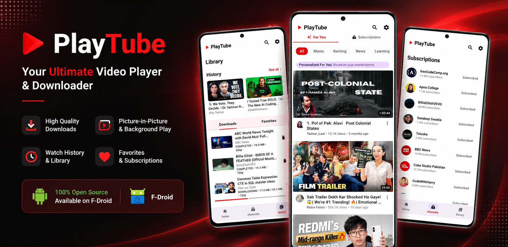
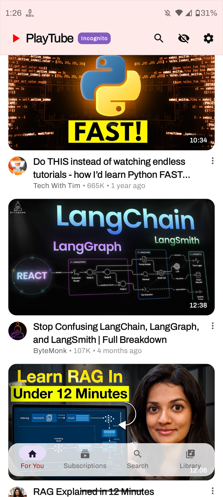
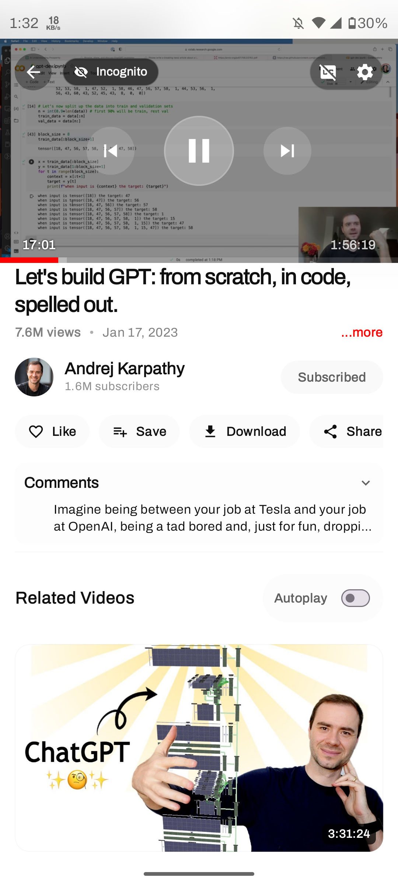
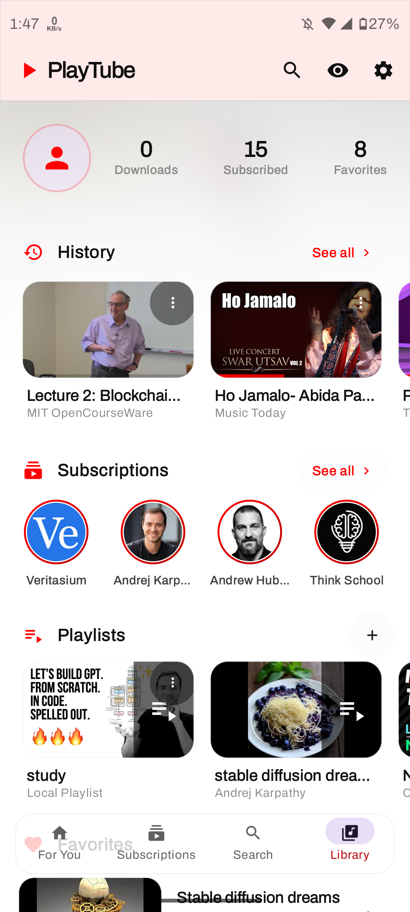
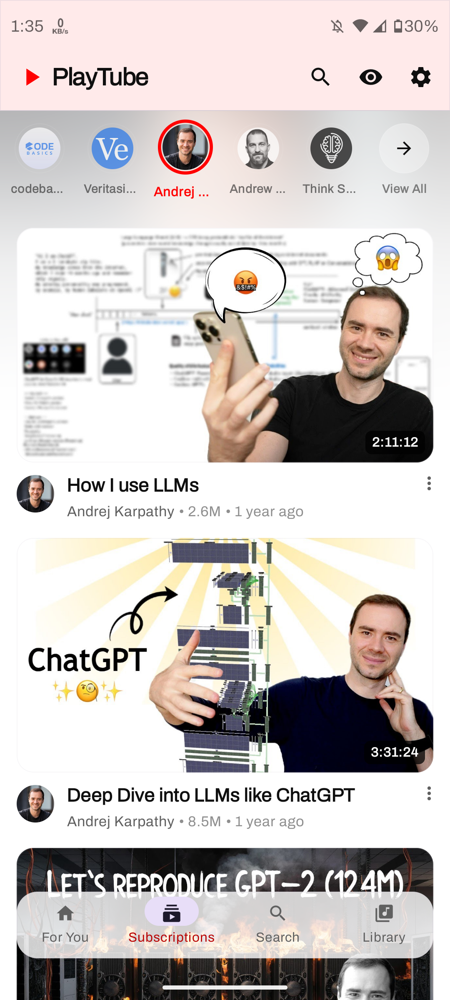
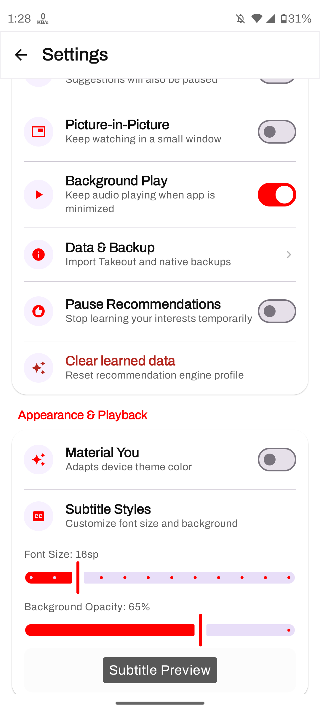
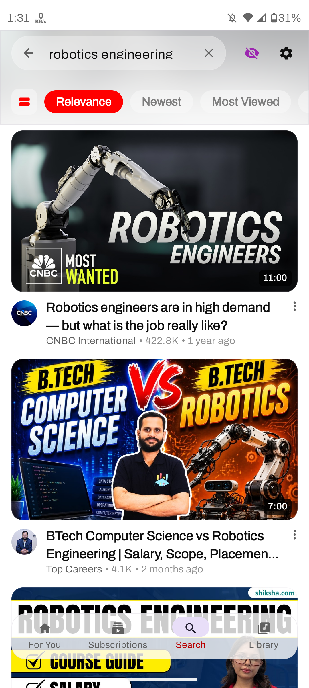

# PlayTube

**Fast, private, and feature-rich YouTube client for Android. No Ads, tracking, or data collection.**

  
<!-- STATUS BADGES -->

  
  
  
  
  
  
  
  

 

  

  

 

Install via <b>Obtainium</b> to receive direct update notifications from GitHub releases.

## ✨ Key Features

*   **Fluid Glass UI:** Dynamic, smooth, and full-screen browsing experience.
*   **Background Play with media controls.** 
*   **Picture-in-Picture (PiP).** 
*   **Subtitles Support.**
*   **Comments.**
*   **Incognito Mode.**
*   **High-Quality Downloads.**
*   **Gesture Controls.**
*   **Orientation Flexibility:** Push up/down landscape and portrait modes.
*   **Subscription Management:** (No Google account required).
*   **Privacy First.**
    
**PlayTube** has a simple learning algorithm that learns & recommends videos based on user activity.

---

## 🛠️ Technology Stack

| Category | Technology | Description |
| :--- | :--- | :--- |
| **App Architecture** | MVVM | Model-View-ViewModel architecture |
| | Clean Architecture | Strict Domain, Data, & UI layer separation |
| | Repository Pattern | Centralized data access from local and remote sources |
| **Kotlin & Reactive** | Kotlin Coroutines | Asynchronous tasks and background operations |
| | StateFlow | Reactive UI state management |
| **UI Framework** | Jetpack Compose | 100% declarative UI toolkit |
| | Material Design 3 | Modern Android UI components and dynamic theming |
| | Compose Animations | Smooth UI animations and transitions |
| **Data Storage** | Room Database | Stores local user metadata |
| | Jetpack DataStore | Stores user preferences (e.g., PiP and History settings) |
| **Media & Networking**| AndroidX Media3 | ExoPlayer integration for video/audio playback |
| | Coil 3 | Fast, modern image loading with caching |
| | NewPipeExtractor | Extracts YouTube streams and metadata |
| | OkHttp | Reliable HTTP networking client |
| **Background & DI** | Hilt (Dagger) | Dependency Injection framework |
| | WorkManager | Guaranteed background task execution for downloads |
| **Build & Tooling** | KSP | Kotlin Symbol Processing for Room & Hilt |
| | Version Catalogs | Centralized dependency and version management |

---
## Thanks to
  - Newpipe extractor.
  - Newpipe.
  - LibreTube.
  - Pipepipe.
  - Flow.
**For making this project possible.**

## 📱 Screenshots

  
  &nbsp;
    
   &nbsp;
  
  &nbsp;
  
  &nbsp;
  
  &nbsp;
  

 

> [!WARNING]
> **Publishing this app on the Google Play Store violates their Terms of Service.**

---

## Support PlayTube

If you enjoy using PlayTube and would like to support its continued development, consider becoming a patron. Your support helps fix bugs and ensures long-term maintenance of the project.

  

